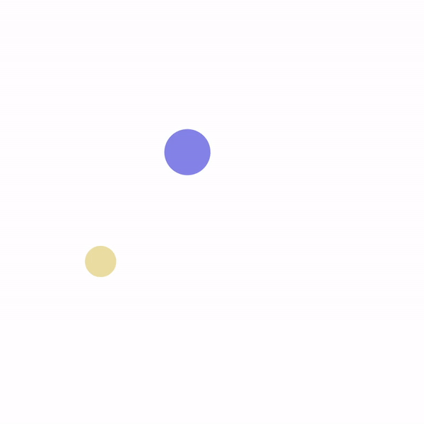

# U15 | Random Bouncing Balls

In diesem Programm beschäftigen Sie sich mit der Kollisionsabfrage im Kontext der GraphicsApp.
Die Aufgabe ist es, zwei Bälle über die Zeichenfläche zu bewegen und sie von den Wänden abprallen zu lassen. Jeder Ball erhält zu Beginn eine zufällige Geschwindigkeit und Größe sowie eine zufällige Farbe, die sich nach jeder Kollision mit einer Wand zu einer anderen zufälligen Farbe ändert. Die Bälle selbst prallen nicht voneinander ab. Verwenden Sie die in der Vorlesung vorgestellte Klasse `Random` um die Zufallswerte zu erzeugen.

| Die springenden Bälle sollen so aussehen |
| :--------------------------------------: |
|       |

**Vorgehen**

Erstellen Sie passende Variablen, für die folgenden Bestandteile des Programms:

- Ein `Circle`-Array indem die Bälle gespeichert werden.

- Ein Objekt der Klasse `Random`.

- Arrays (primitive Datentypen) für die Geschwindigkeit in x und y Richtung - diese werden auf Zufallswerte gesetzt.
- Die obere und untere Grenze für diese Werte werden als Konstanten gespeichert.

Zusätzlich verfügt das Programm über zwei Konstanten, die für die zufällige Auswahl der Größe (bei der Initialisierung) des Balls genutzt werden sollen:

```java
private static final int MIN_DIAMETER = 50;
private static final int MAX_DIAMETER = 100;
```

Wir brauchen folgende Methoden:

- `update (Circle ball, int xSpeed, int ySpeed)` - ändert die Position des übergebenen Balls auf der Basis der übergebenen aktuellen Geschwindigkeit.

- `checkXWallCollision (Circle ball)` - überprüft, ob der Ball mit der linken oder rechten Wand der Zeichenfläche kollidiert. Berührt der Ball eine der Wände, so werden entsprechend Bewegungsrichung und Farbe angepasst.
- `checkYWallCollision (Circle ball)` - überprüft, ob der Ball mit der oberen oder unteren Wand der Zeichenfläche kollidiert. Berührt der Ball eine der Wände, so werden entsprechend Bewegungsrichung und Farbe angepasst.

Beachten Sie bitte, dass Sie wahrscheinlich weitere Methoden innerhalb der Klasse anlegen müssen.

In der `draw`-Methode werden bei jedem Aufruf der Hintergrund neu gezeichnet und die beiden Bälle aktualisiert und neu gezeichnet. Rufen Sie dafür die Methoden zur Kollisionsabfrage, zum _updaten_ und zum Zeichnen in einer sinnvollen Reihenfolge für beide Objekte auf.
