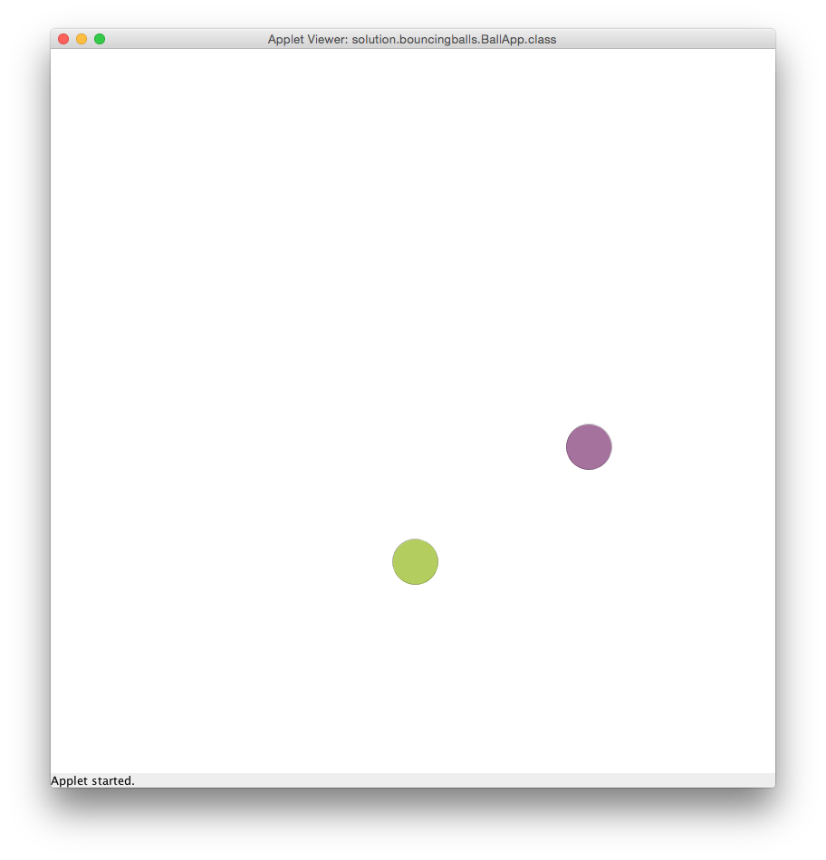

# U15 | Random Bouncing Balls

In diesem Programm beschäftigen Sie sich mit der Klassenmodellierung im Kontext der GraphicsApp.
Die Aufgabe ist es, zwei Bälle über die Zeichenfläche zu bewegen und sie
von den Wänden abprallen zu lassen. Jeder Ball erhält zu Beginn eine zufällige
Geschwindigkeit und Größe sowie eine zufällige Farbe, die sich nach
jeder Kollision mit einer Wand zu einer anderen zufälligen Farbe ändert. Die Bälle selbst prallen nicht voneinander ab. Verwenden Sie die in der Vorlesung vorgestellte Klasse `Random` um die Zufallswerte zu
erzeugen.

| Die springenden Bälle sollen so aussehen |
|:------:|
|  |

**Vorgehen**

Erstellen Sie eine eigene Klasse `RandomBall`, die über die folgenden
Instanzvariablen verfügt:

-   Ein Objekt der Klasse `Ellipse` zum Zeichnen des Balls.

-   Ein Objekt der Klasse `Random`.

-   Variablen (primitive Datentypen) für die Geschwindigkeit in x und y
    Richtung - diese werden bei Objekterzeugung auf Zufallswerte
    gesetzt. Die obere und untere Grenze für diese Werte werden dem
    Konstruktor der Klasse übergeben.

Zusätzlich verfügt die Klasse über zwei Konstanten, die für die
zufällige Auswahl der Größe (bei der Initialisierung) des Balls genutzt
werden sollen:

``` java
private static final int MIN_DIAMETER = 50;
private static final int MAX_DIAMETER = 100;
```

Die Klasse `RandomBall` benötigt die folgenden `public`-Methoden:

-   Einen Konstruktor mit Parametern für die Breite und Höhe der
    Zeichenfläche sowie der oberen und unteren Grenze zur Bestimmung
    der zufälligen Geschwindigkeit. Im Konstruktor wird der
    Zufallsgenerator angelegt um damit die Größe, Farbe und
    Geschwindigkeit des Balls zu bestimmen und ihn an einer zufälligen
    Position zu platzieren.

-   `update` - ändert die Position des `RandomBall` auf der Basis der
    aktuellen Geschwindigkeit

-   `draw` - zeichnet den `RandomBall`

-   `checkWallCollision(int canvasWidth, int canvasHeight)` - überprüft
    ob der Ball mit einer der Wände der Zeichenfläche (bestimmt über die
    Parameter) kollidiert. Berührt der Ball eine der Wände, so werden
    entsprechend Bewegungsrichung (siehe Vorlesungsbeispiel:
    BouncingBall) und Farbe angepasst.

Beachten Sie bitte, dass Sie wahrscheinlich weitere `private`-Methoden
innerhalb der Klasse anlegen müssen, um Ihren Code übersichtlich zu
gestalten.

Zusätzlich zur Klasse `RandomBall` müssen Sie die vorgegebene Klasse
`RandomBouncingBalls` fertig implementieren. In dieser sollen Sie die beiden Objekte der Klasse `RandomBall` erzeugen und die Kollision mit den Seitenwänden überprüfen. Initialisieren Sie die Zeichenfläche und die Bälle in der `initialize`-Methode.\
(*Decomposition*: Lagern Sie die Teilbereiche der Initialisierung in einzelne Methoden aus, die dann in `initialize` aufgerufen werden)

In der `draw`-Methode werden bei jedem Aufruf der Hintergrund
neu gezeichnet und die beiden Bälle aktualisiert und neu gezeichnet.
Rufen Sie dafür die Methoden zur Kollisionsabfrage, zum *updaten* und
zum Zeichnen in einer sinnvollen Reihenfolge für beide Objekte auf.
